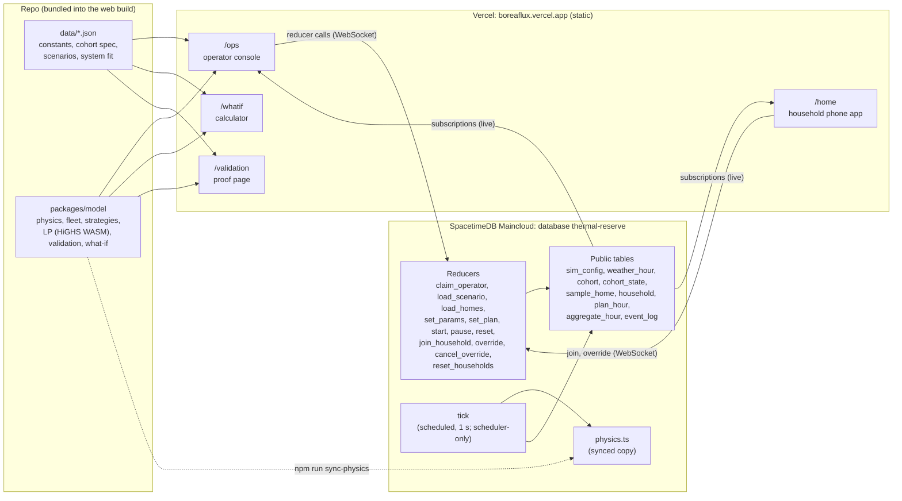
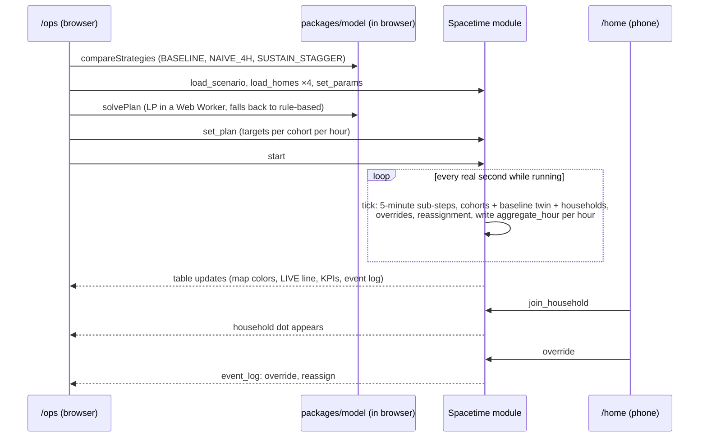
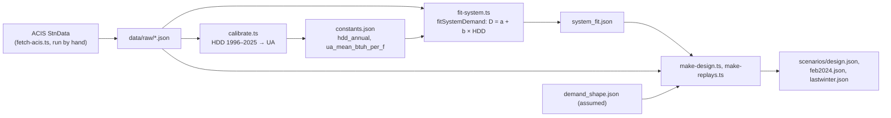
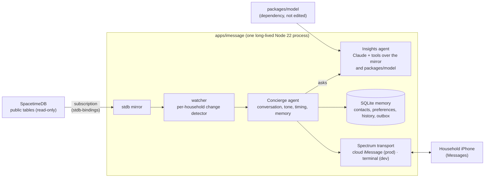

# Architecture

Two hosted pieces make up the product: a **SpacetimeDB module on Maincloud** that holds all shared state and runs the simulation clock, and a **static React app on Vercel** that every screen loads. No laptop process runs during judging; the operator console is a browser tab.

**Planned third piece (CHAT, in progress; see "iMessage companion" below):** a long-lived Node process (`apps/imessage`) that texts enrolled households through Photon's Spectrum framework. It runs on a **team laptop** during judging (H3's decision, allowed by H1 in msg 173): the one exception to the rule above. The four web routes never depend on it.

The browser computes whole-horizon comparisons and the LP (deterministic, needed instantly for charts). The server owns the live run that every phone and the map watch. One physics source file (`packages/model/src/physics.ts`) runs in both places, and a test asserts the two agree on a fixed scenario.

## System diagram

`/whatif` and `/validation` read only `data/` and `packages/model`; they work with no Spacetime connection.

## Live run, step by step

## Components

| Component | Tech | Runs where | Owner |
| --- | --- | --- | --- |
| Spacetime module | SpacetimeDB TypeScript server module (`stdb/`) | Maincloud: `thermal-reserve` (production), `thermal-reserve-dev` (test) | STDB |
| Client bindings | `spacetime generate --lang typescript` → `packages/stdb-bindings` (committed) | Browser | STDB |
| Physics, strategies, LP, validation, what-if | Pure TypeScript, `packages/model` | Browser; `physics.ts` and `types.ts` also inside the module | ENGINE |
| LP solver | `highs` (HiGHS compiled to WebAssembly), CPLEX LP text | Browser Web Worker | ENGINE |
| Web app | React, Vite, TypeScript, Tailwind, React Router (`apps/web`) | Vercel static build | WEB |
| iMessage companion (planned) | Node 22, Photon Spectrum (`spectrum-ts`), Claude API, SQLite (`apps/imessage`) | Long-lived process on a team laptop during judging | CHAT |
| Charts, map, QR | Recharts; Leaflet with OpenStreetMap tiles (SVG fallback); qrcode.react | Browser | WEB |
| Data and scenarios | JSON in `data/`, rebuilt offline by `npm run data` from saved ACIS responses | Repo, bundled into the web build | DATA |
| Tests | Vitest in each workspace | Developer machines; merge gate | Each owner |

## Data pipeline (offline)

## iMessage companion (CHAT, in progress)

Owner: CHAT, Agent Mail name GreenGorge (earlier session ScarletDesert) (`apps/imessage/**`). Brief: `docs/agents/CHAT_BRIEF.md`. **Status (Oct 4, ~05:25Z):** Phase 1 done on `thermal-reserve-dev` (linking by code, watcher, throttled catch-up texts, STOP, SQLite memory, no duplicates after restart; tested on H3's iPhone). Phase 2 (Concierge + Insights, honesty guard, handoff log) is coded and unit-tested offline, waiting for an API key for its live acceptance. Both agents run on **Claude Haiku 4.5** at runtime (H3's choice, lowest cost). Branch `chat/phase1`, merged by STDB.

**Pressure overhaul wording (CHAT msg 255, `chat/phase1` 6588016):** `sim_config.capacity_mmcfd` now holds the delivery rate R, so the companion's "why" answers say "demand above the delivery rate" (not "capacity" or "shortfall") and never quote pressure numbers. Pressure is shown only on `/ops` and `/home`.

**Shared-line caveat (CHAT, Phase 1):** Photon's shared line routes a person's replies to us only for a while after we last texted them (replies stopped arriving after ~35 min of silence). The companion texts the demo phone at startup (`CHAT_HELLO_TO`), so start it ≤ 5 minutes before the iMessage demo step.

The table below is the brief's design; parts not yet built are noted above.

| Part | What it does | Notes |
| --- | --- | --- |
| Transport | Photon Spectrum (`spectrum-ts`): cloud iMessage provider in production, terminal provider for offline development | Spectrum is required for the prize track; no other iMessage bridge |
| Watcher | Turns household state changes (setback start, depth change, recovery, override, event end) into notable events; throttles and coalesces them into one catch-up message | At most one proactive text per household per ~20 s; never one per tick |
| Concierge | Owns the conversation: intent, tone, tapbacks, quiet hours, preferences, STOP | Never computes numbers itself |
| Insights | (Claude Haiku 4.5) Answers "why" questions with deterministic tools (`household_now`, `plan_window`, `weather`, `gas_day`, `explain_decision`, `compare_strategies`, `constant`, `what_if`) | Every number must come from a tool result; a post-check rejects any number no tool produced |
| Memory | SQLite in `apps/imessage/data/` (gitignored): contacts, per-person memory, thread history, outbox | Deleted on STOP and when the household is reset |

**Phone ↔ household link:** preferred design A is inbound-first: the user texts a code from `/home`, so no phone number is stored in SpacetimeDB. Fallback B adds a private `household_contact` table (H1 approval, STDB implements). Decided in CHAT's Phase 0.

**Update (Oct 4, H1 `[CONTRACT]` msg 278): design B approved, with no email.** STDB added (main `96eafbd`, `[CONTRACT]` msg 282; live on `thermal-reserve-dev`, production publish with H1): a **private** table `household_contact(identity, first_name, last_name, phone, opted_in_at)` (the phone is stored as E.164 in a column named `phone`); `set_contact(first_name, last_name, phone)` for the caller's own household only (first name required, names cut at 40 characters, phone must be `+` and 8–15 digits, a repeat call replaces the row); `clear_contact()`; `claim_contact_reader(passcode)`, which makes one identity (the companion) the only reader; and the view `contact_feed`, which returns rows only to that reader. `reset_households` deletes all contacts. A private `contact_reader` table holds the reader identity. `remove_contact(identity)` (reader only, STDB msg 284) lets the companion delete a household's contact when it replies STOP.

CHAT verified on dev (msg 285) that a reader's WebSocket subscription to `contact_feed` receives a new contact about 0.5 s after `set_contact`, a non-reader sees 0 rows, and `clear_contact` arrives as a delete. The companion claims the reader at start, adds each new number to Photon and sends an opener asking for YES, and forgets the number on delete. Onboarding is off unless `CHAT_ONBOARD=1`.

Companion texts (CHAT msg 285): opener "BoreaFlux demo here for <nickname>. You asked on the household page for heat updates by text during a simulated cold snap. Reply YES to start, or STOP and I won't text again." Reply to YES: "Thanks. You're set for <nickname>: I'll text you when a cold-snap event changes its heat (a simulation; no real thermostat). Ask me anything, or reply STOP any time." WEB adds optional first name, last name and phone fields with an unchecked "Text me updates by iMessage" opt-in on the `/home` consent step; the three-tap join still works with them empty. CHAT adds each opted-in number to our Photon project (Photon only texts numbers on its user list) by running the pinned CLI with `npx -y @photon-ai/cli@2.2.0` on the team laptop. It is not added to `package.json`, so the lockfile is unchanged: adding it to the workspace hit an npm 10 bug that would have broken the lock (CHAT msg 280). Photon's CLI requires an email, so the companion passes a generated placeholder at the reserved `.invalid` domain; no email is ever collected or stored. H3's Photon login stays on the laptop, never in the repo. Approved `/home` copy (H3): an unchecked "Text me updates by iMessage"; fields First name, Last name, Phone; and "Demo only. Your name and number are stored privately for this demo, never shown publicly, and deleted when you reply STOP or the demo resets." No phone number ever goes in a public table.

**H1's decisions (Oct 4, msg 167):**
- Dependencies approved, in `apps/imessage` only: `spectrum-ts`, `@anthropic-ai/sdk`; SQLite via Node's built-in `node:sqlite` (`better-sqlite3` only if that fails).
- Link design **A** (inbound-first text with a code; no Spacetime schema change). B only if A proves impossible.
- Hosting during judging: **a team laptop** (H3 decided, Oct 4; H1 allowed either option in msg 173). No hosted account. The laptop must stay awake, plugged in and online through judging, with `apps/imessage/.env` present locally (never committed).
- The Sunday 10:00 code freeze applies to CHAT, and the four web routes must never depend on it.
- `apps/imessage` tests must pass offline with no credentials (merge gate). CHAT reads `thermal-reserve-dev` read-only with its own identity.

**Found in CHAT's Phase 0 (Oct 4, 04:28Z):** iMessage from Linux through Spectrum's cloud line reached an iPhone, replies come back to Node, and household updates stream from `thermal-reserve-dev`. **Photon only sends to numbers added as project users** ("Target not allowed for this project"), so every demo and judge phone must be added in the Photon dashboard before it can link. CHAT proposes "B-lite": the same inbound code as design A, plus that allowlist step; no schema change.

**Still open:** which database the judged demo uses (`thermal-reserve` or `thermal-reserve-dev`; asked of H1, msg 178); Photon project and API keys (humans; never committed).

## Decisions worth knowing

- **Capacity is a daily limit** per gas day (calendar day from scenario start). Within-day swings are assumed covered by linepack and storage; `aggregate_hour.capacity_mmcf` shows capacity ÷ 24 as an average.
- **Operator passcode** lives in a private table; the first `claim_operator` sets it.
- **Reducer arguments** are JSON strings with the camelCase keys of the `packages/model` types.
- **Households** are placed near a random sample home and use a cohort template matching their heating type.

Full contracts: `AGENTS.md` Sections 6–9. Current STDB state and deviations: `stdb/HANDOFF.md`.
