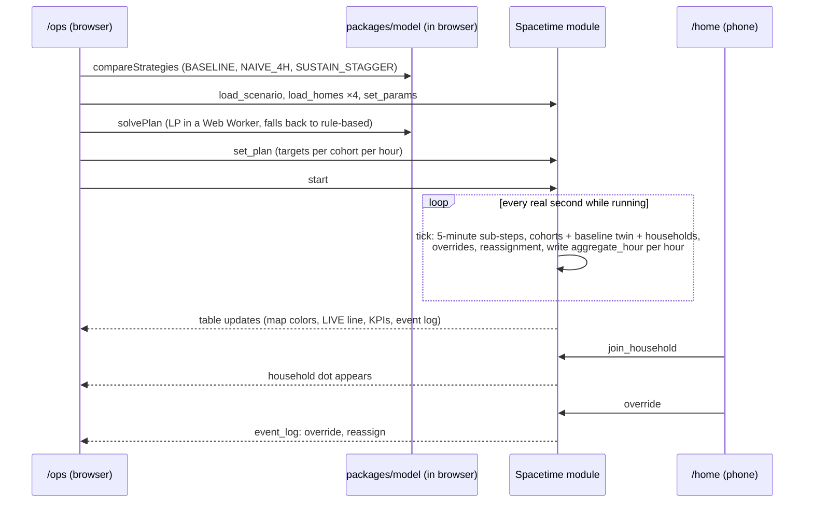
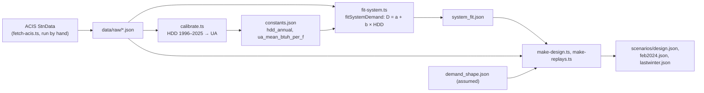

# Architecture

Two hosted pieces make up the product: a **SpacetimeDB module on Maincloud** that holds all shared state and runs the simulation clock, and a **static React app on Vercel** that every screen loads. No laptop process runs during judging; the operator console is a browser tab.

The browser computes whole-horizon comparisons and the LP (deterministic, needed instantly for charts). The server owns the live run that every phone and the map watch. One physics source file (`packages/model/src/physics.ts`) runs in both places, and a test asserts the two agree on a fixed scenario.

## System diagram

`/whatif` and `/validation` read only `data/` and `packages/model`; they work with no Spacetime connection.

## Live run, step by step

## Components

| Component | Tech | Runs where | Owner |
| --- | --- | --- | --- |
| Spacetime module | SpacetimeDB TypeScript server module (`stdb/`) | Maincloud: `thermal-reserve` (production), `thermal-reserve-dev` (test) | STDB |
| Client bindings | `spacetime generate --lang typescript` → `packages/stdb-bindings` (committed) | Browser | STDB |
| Physics, strategies, LP, validation, what-if | Pure TypeScript, `packages/model` | Browser; `physics.ts` and `types.ts` also inside the module | ENGINE |
| LP solver | `highs` (HiGHS compiled to WebAssembly), CPLEX LP text | Browser Web Worker | ENGINE |
| Web app | React, Vite, TypeScript, Tailwind, React Router (`apps/web`) | Vercel static build | WEB |
| Charts, map, QR | Recharts; Leaflet with OpenStreetMap tiles (SVG fallback); qrcode.react | Browser | WEB |
| Data and scenarios | JSON in `data/`, rebuilt offline by `npm run data` from saved ACIS responses | Repo, bundled into the web build | DATA |
| Tests | Vitest in each workspace | Developer machines; merge gate | Each owner |

## Data pipeline (offline)

## Decisions worth knowing

- **Capacity is a daily limit** per gas day (calendar day from scenario start). Within-day swings are assumed covered by linepack and storage; `aggregate_hour.capacity_mmcf` shows capacity ÷ 24 as an average.
- **Operator passcode** lives in a private table; the first `claim_operator` sets it.
- **Reducer arguments** are JSON strings with the camelCase keys of the `packages/model` types.
- **Households** are placed near a random sample home and use a cohort template matching their heating type.

Full contracts: `AGENTS.md` Sections 6–9. Current STDB state and deviations: `stdb/HANDOFF.md`.
